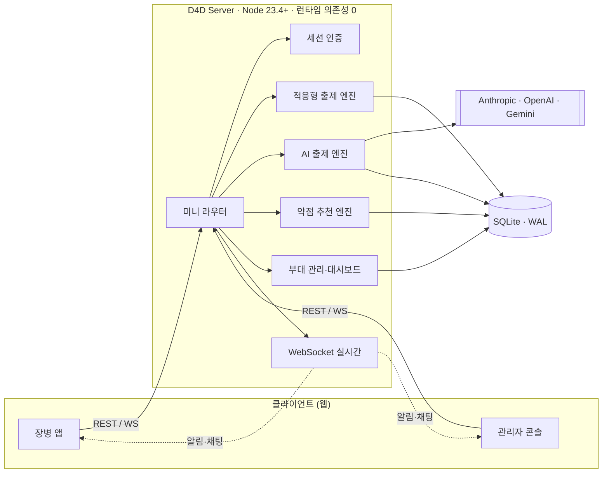
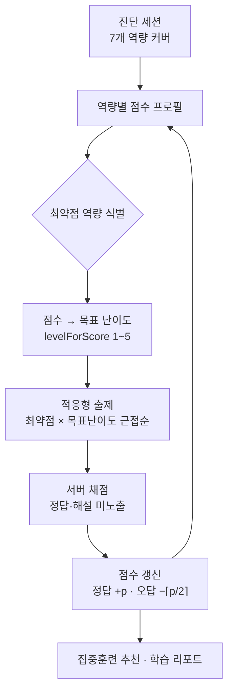
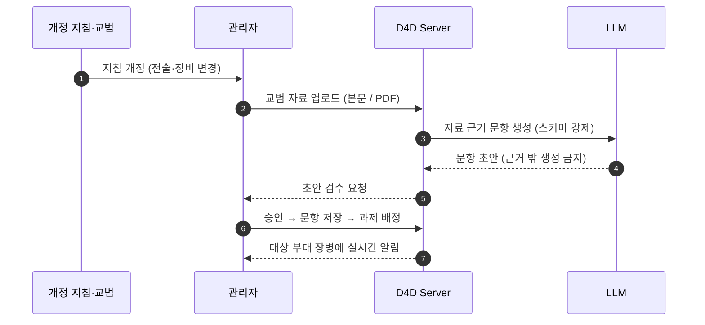

<div align="center">

# D4D · 징병·단기복무 전술 숙달 가속 시뮬레이터
### Conscript Readiness Accelerator

**짧아지는 복무 기간, 줄어드는 병력. 전역 전에 숙련되게 만든다.**

개인 맞춤 적응형 훈련으로 초급 전투원의 *숙련 도달 시간*을 압축하는 국방 학습 플랫폼


<sub>트랙 · **Force Readiness, Training & Simulation** (전투준비·교육·시뮬레이션) — EGCED TECH</sub>

</div>

---

## 한눈에 보기

**D4D**는 장병이 정식 훈련에 앞서 *사전 학습(pre-training)* 으로 전술·장비 숙련도를 끌어올리는 적응형 시뮬레이터다. 개인의 학습 속도에 맞춰 약점을 자동으로 찾아 집중 출제하고, 흩어져 있던 장병 학습 데이터를 부대 단위로 취합해 **전력화 가능한 형태**로 가시화한다. 나아가 지침이 개정될 때마다 관리자가 교범만 올리면 **AI가 그 자료를 근거로 훈련 문항을 자동 생성**해, 훈련 콘텐츠가 야전의 변화를 실시간으로 따라간다.

> 서버는 **런타임 의존성 0** — Node 내장 모듈(`node:http`·`node:sqlite`·`node:crypto`·`node:net`)만으로 구현했다. 공급망 위험과 배포 표면을 최소화해 보안이 중요한 국방·폐쇄망 환경을 염두에 둔 설계다.

---

## Problem — 왜 필요한가

대한민국처럼 **의무 복무·단기 복무 중심**의 국방 환경은 구조적 한계를 안는다.

- **숙련의 정점에 도달하기 전에 전역한다.** 전술적 숙련도와 첨단 장비 운용 능력이 무르익기 전에 병사가 복무를 마치고 떠난다.
- **병력 자원이 절대적으로 감소한다.** 사람이 줄어드는데, 한 명 한 명을 더 빨리 전력으로 만들어야 하는 압박은 커진다.
- **정형화된 집체 교육으로는 부족하다.** 모두를 같은 속도·같은 내용으로 가르치는 방식으로는, 제한된 복무 기간 안에 숙련된 전투 요원을 길러내기 어렵다.
- **야전은 계속 바뀐다.** 전술과 장비가 달라질 때마다 지침이 개정되지만, 훈련 콘텐츠의 최신화는 그 속도를 따라가지 못한다.

> 필요한 것은, 초급 전투원이 **가상 환경에서 개인의 학습 속도에 맞춰 전술 기동과 장비 조작을 초고속으로 체득**하는 *정밀 학습 가속 시뮬레이터*다. 이는 단기간에 최상의 전투 준비태세(Readiness)를 확보하고 군 전체의 전력 공백을 막는 핵심 솔루션이다.

---

## Solution — D4D

D4D는 위 문제를 **개인화된 적응형 훈련 시뮬레이터**로 정면 돌파한다. 세 축으로 움직인다.

| 축 | 하는 일 |
| --- | --- |
| **① 가속 학습** | 진단으로 약점을 찾고, 개인의 점수에 맞춘 난이도로 최약점 역량을 집중 반복시켜 숙련 도달 시간을 압축 |
| **② 데이터 전력화** | 모든 학습·응답·체력 기록을 개인/부대 단위로 취합해, 지휘관이 부대 전투 준비태세를 한눈에 파악 |
| **③ 콘텐츠 최신화** | 지침이 바뀌면 교범을 올리는 것만으로 AI가 근거 기반 훈련 문항을 자동 출제 → 훈련이 야전을 따라감 |

---

## 핵심 강점 — 요청 기능이 실제 코드로 구현되어 있다

해커톤 트랙이 요구한 역량과, 그것을 구현한 서버 로직을 그대로 매핑했다.

| 요구 역량 | D4D 구현 | 근거 코드 |
| --- | --- | --- |
| **개인별 숙련도 진단·적응형 커리큘럼** | 7개 전투역량을 커버하는 진단 세션 → 카테고리별 점수 프로필 → 최약점을 목표 난이도로 집중 출제하는 적응형 세션 + 관리자 과제 배정 | `routes/training.ts`, `routes/curriculum.ts` |
| **장비·절차 반복 시뮬레이션** | 장비운용(EQP) 포함 7역량, **상황형(situational)**·선택형 문항으로 절차를 반복 숙달 | `db/seed.ts`, `routes/training.ts` |
| **약점 자동 식별·집중 훈련 추천** | 지식 최약 역량 + 체력 최약 종목 + 미완료 과제를 종합해 "지금 뭘 할지" 추천 카드 생성 | `routes/recommend.ts`, `routes/report.ts` |
| **숙련 도달 시간 단축 지표** | 역량별 점수·시도·정답, 등급(S~D), 문항별 소요시간(`elapsed_sec`) 기록과 학습 리포트 | `lib/score.ts`, `routes/report.ts` |
| **부대 단위 숙련도 현황 가시화** | 부대별 인원·진척·현황 대시보드, 부대 스코핑(부대 관리자는 자기 부대만) | `routes/admin.ts` |
| **⭐ 지침 최신화 자동 반영** | 교범(본문/PDF) 업로드 → **AI가 자료 근거로만** 문항 초안 생성 → 검수 → 저장·배정 | `lib/ai.ts`, `routes/curriculum.ts` |

### ⭐ 가장 강한 한 방 — AI 자동 출제

관리자가 개정된 교범을 올리면 D4D가 **그 자료만을 근거로** 훈련 문항을 만든다. 출제 부담 없이 훈련 콘텐츠가 지침 개정 속도를 따라잡는다.

- **환각 차단, 근거 기반.** 시스템 프롬프트가 *"주어진 교범 자료만을 근거로, 자료에 없는 내용은 지어내지 않는다"* 를 강제한다.
- **구조화 출력 강제.** 세 프로바이더 모두 스키마로 출력을 고정한다 — Anthropic은 tool-use `input_schema`, OpenAI는 `response_format.json_schema(strict)`, Google은 `responseSchema`.
- **멀티 프로바이더 + PDF.** Anthropic·OpenAI·Gemini 중 활성 연동을 선택 사용하며, Anthropic/Gemini는 PDF 교범을 그대로 첨부해 출제한다.
- **사람이 최종 검수.** AI는 *초안*만 낸다. 관리자가 확인·수정 후 저장해야 실제 문항이 되고, 문항은 출처 자료(`material_id`)와 연결된다.

---

## 동작 원리

### 시스템 구성



### 적응형 학습 루프 — 숙련을 가속하는 방식



약한 곳을, 지금 실력에 딱 맞는 난이도로, 반복해서 — 이 루프가 제한된 복무 기간 안에서 숙련 도달 시간을 압축한다.

### 지침 최신화 → AI 자동 출제 루프



---

## 주요 사용자 흐름

**장병 (trainee)** — 부대 코드로 가입 → 진단 테스트 → 적응형 훈련 반복 → 약점 추천·리포트로 자기 성장 확인 → 배정 과제·체력 프로그램 수행.

**관리자 (admin)** — 부대·계정 관리 → 교범 업로드·AI 출제·문항 검수 → 커리큘럼(과제) 배정 → 부대 숙련도 대시보드 모니터링 → 장병과 1:1 채팅.

---

## 기술 스택 & 아키텍처

### 설계 철학 — "가볍고, 닫혀도 돌아가게"

국방 환경을 염두에 두고 **런타임 의존성 0**을 원칙으로 삼았다. 외부 패키지 없이 Node 내장 모듈만 쓰므로 공급망 공격 표면이 없고, 폐쇄망에서도 빌드·배포가 단순하다. 라우터와 WebSocket 서버까지 직접 구현해 전체 동작을 투명하게 통제한다.

### 스택

| 영역 | 채택 | 비고 |
| --- | --- | --- |
| 런타임 | **Node.js 23.4+** | `node:http`·`node:sqlite`·`node:crypto`·`node:net` |
| 언어 | **TypeScript (ESM)** | `tsc` 빌드, `--watch` 개발 |
| 데이터베이스 | **SQLite** (`node:sqlite`) | WAL 저널, FK 제약, 무설치 |
| 실시간 | **커스텀 WebSocket** | RFC 6455 직접 구현 (`lib/ws.ts`) — 알림·채팅 |
| 라우팅 | **커스텀 미니 라우터** | `:param` 지원 (`router.ts`) |
| 인증 | 세션 토큰 → **sha256 해시 저장** | httpOnly 쿠키 + `Bearer` 병행 |
| 비밀번호 | **scrypt** 해시 (`lib/password.ts`) | |
| 시크릿 | **AES-256-GCM** (`lib/crypto.ts`) | AI 키는 DB에 암호문으로만 저장, 인증 태그로 위·변조 탐지 (`APP_SECRET_KEY`) |
| AI | **Anthropic · OpenAI · Google Gemini** | 구조화 출력 강제, PDF 지원 |
| 문서 | **OpenAPI / Swagger UI** | `/api/docs` |
| 배포 | **Docker + Compose + GitHub Webhook** | HMAC 검증 자동배포 |

> 장병 웹앱과 관리자 콘솔은 별도 프론트엔드로 제공되며, 본 서버의 REST API와 WebSocket을 그대로 사용한다(프론트 앱 포트 `9555`). 이 저장소는 백엔드(`d4d_server`) 범위다.

### 보안 설계

- **채점은 서버가 한다.** 문항의 정답·해설은 클라이언트로 내려가지 않는다 — 답을 알 수 없으니 클라이언트 조작이 무의미하다.
- **세션 토큰은 원문을 저장하지 않는다.** DB에는 sha256 해시만 남는다.
- **AI 키는 암호문으로만 저장.** AES-256-GCM으로 암호화하고, 인증 태그로 위·변조를 탐지한다(마스터 키 `APP_SECRET_KEY`). 비밀번호는 scrypt + 타이밍 세이프 비교.
- **역할·부대 스코핑.** 관리자/장병 역할 분리, 부대 관리자는 자기 부대 데이터만 접근.
- **레이트리밋 · CORS 오리진 제한 · 관리자 가입 코드**로 오남용을 차단한다.

### 데이터 모델 (핵심 테이블)

```
units · users · sessions            부대 · 계정 · 세션
categories · questions · materials  7대 역량 · 문항 · 교범(AI 출제 근거)
user_scores · training_sessions · answers   역량별 점수 · 훈련 세션 · 답안
assignments · assignment_progress   커리큘럼(과제) 배정·수행
programs · program_progress · fitness_records   체력/교육 프로그램 · 특급전사 기록
ai_providers                        AI 연동 (암호화 키)
chat_threads · chat_messages · notifications   실시간 채팅 · 알림
```

### 7대 전투역량 카테고리

`전술기동(TAC)` · `화력운용(FIR)` · `지형판독(TER)` · `통신절차(COM)` · `전장응급처치(MED)` · `화생방(NBC)` · `장비운용(EQP)`

---

## 디렉토리 구조

```
src/
├── index.ts        # HTTP 서버 + WS 업그레이드 + CORS + 에러/로깅
├── config.ts       # .env 로드 및 설정
├── router.ts       # 초소형 라우터 (:param 지원)
├── db/             # SQLite 연결·스키마(migrate)·시드(seed)
├── middleware/     # 세션 인증 (requireAuth / requireAdmin)
├── routes/         # auth · training · curriculum · recommend · report
│                   # admin · chat · fitness · programs · notifications · categories
└── lib/            # ai(출제) · ws · score · crypto · password · rateLimit · http · notify
```

---

## API

**Swagger 문서: `http://localhost:9666/api/docs`** (스펙 JSON: `/api/docs/openapi.json`)
Authorize 버튼에 로그인 응답의 `token` 을 넣으면 브라우저에서 바로 테스트할 수 있다.

| Method | Path | Auth | 설명 |
| --- | --- | --- | --- |
| GET | `/api/health` | - | 헬스체크 |
| POST | `/api/auth/register` | - | 가입 — 장병은 부대 코드(`unitCode`) 필수, 관리자 가입은 `ADMIN_INVITE_CODE` 일치 시 |
| POST | `/api/auth/login` | - | 로그인 → `{user, token}` |
| GET | `/api/auth/me` | ✓ | 내 정보 |
| GET | `/api/categories` | - | 전투 역량 7개 카테고리 |
| GET | `/api/me/scores` | ✓ | 내 카테고리별 점수 프로필 |
| POST | `/api/training/sessions` | ✓ | 세션 시작 `{mode: 'diagnostic'\|'adaptive', category?}` → 문항(정답 제외) |
| GET | `/api/training/sessions/active` | ✓ | 진행 중 세션 이어하기 (새로고침 복구) |
| POST | `/api/training/sessions/:id/answers` | ✓ | 답안 제출 → 서버 채점/해설/점수 |
| GET | `/api/report` | ✓ | 학습 리포트 (통계·강점/약점 분석) |
| GET | `/api/me/assignments` | ✓ | 나에게 배정된 과제 |
| GET | `/api/admin/dashboard` | 관리자 | 부대 현황 (소속 관리자는 자기 부대만) |
| GET/POST | `/api/admin/units` | 관리자 | 부대 목록 / 생성(가입 코드 자동 발급) |
| GET/POST | `/api/admin/materials` | 관리자 | 교범 자료 목록 / 등록 (본문·PDF) |
| POST | `/api/admin/materials/:id/generate-questions` | 관리자 | **AI 문항 초안 생성** `{count?, difficulty?, instructions?}` |
| GET/POST | `/api/admin/questions` | 관리자 | 문항 목록 / 등록 (AI 초안 검수 후 저장) |
| GET/POST | `/api/admin/assignments` | 관리자 | 커리큘럼(과제) 목록 / 배정 → 실시간 알림 |
| GET/POST | `/api/admin/ai-providers` | 관리자 | AI 연동 목록 / 등록 (키 암호화 저장) |

점수 규칙: 정답 `+points`, 오답 `−⌈points/2⌉`, 0~100 클램프. 등급 S(90+)/A(75+)/B(60+)/C(40+)/D.

---

## 실행

```bash
cp .env.example .env   # 값 채우기
npm run dev            # 개발 (--watch)
npm start              # 운영
```

최초 기동 시 SQLite(`data/d4d.db`)에 스키마와 기본 데이터(카테고리·문항·교범 자료)가 자동 주입되고, 관리자 계정이 생성된다. `ADMIN_PASSWORD` 를 비워두면 랜덤 비밀번호가 로그에 1회 출력된다.

---

## 배포 (front 와 동일한 웹훅 방식)

GitHub push → 웹훅 서버(`:9446`)가 HMAC 검증 후 `deploy/deploy.sh` 실행 → docker build → 컨테이너 교체(포트 `9666`). SQLite 데이터는 네임드 볼륨 `d4d-server-data` 에 보존된다.

```bash
bash deploy/webhook-up.sh          # 웹훅 컨테이너 기동
bash deploy/deploy.sh              # 수동 배포
docker logs -f d4d-server          # API 로그
docker run --rm -v d4d-server-data:/data alpine \
  tar czf - -C /data . > d4d-backup.tar.gz   # DB 백업
```

포트 정리: front 앱 `9555` / front 웹훅 `9444` / **server API `9666` / server 웹훅 `9446`**

### 트러블슈팅

**`Error: unable to open database file` (ERR_SQLITE_ERROR, errcode 14)** — DB 디렉터리에 컨테이너 사용자(node, uid 1000)가 쓸 수 없는 경우다. 기본 구성(네임드 볼륨 `d4d-server-data`)에서는 발생하지 않는다. 직접 바인드 마운트로 바꿨다면 호스트에서 `sudo chown -R 1000:1000 <호스트경로>` 로 소유권을 맞춰야 한다. 배포 스크립트는 웹훅 컨테이너 안에서 실행되므로, 바인드 마운트가 필요하면 반드시 **호스트 기준 절대경로**를 사용할 것.

---

<div align="center">
<sub>D4D — 짧아진 복무 기간을, 더 빠른 숙련으로. · EGCED TECH · Force Readiness, Training & Simulation</sub>
</div>
