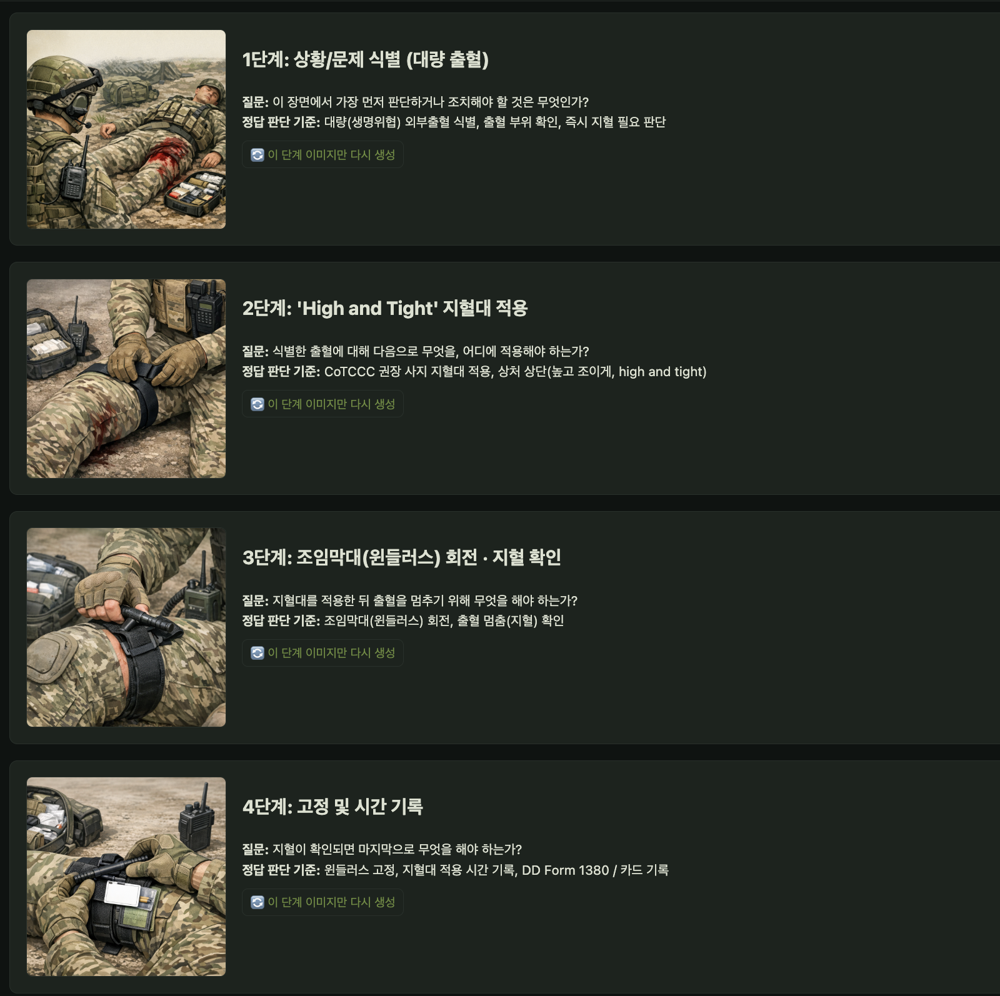
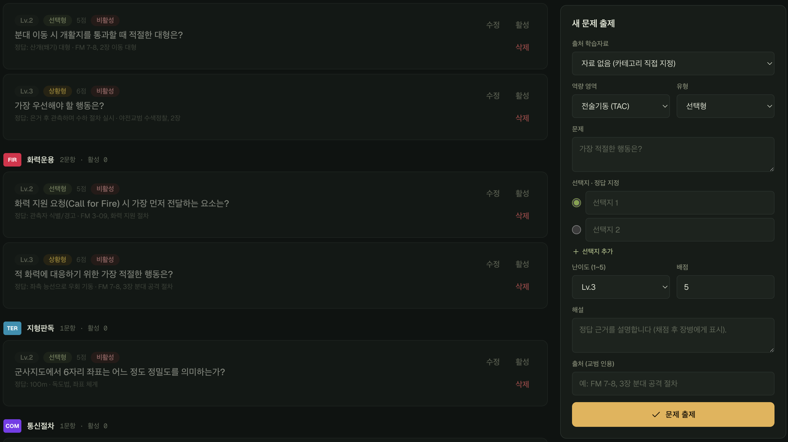
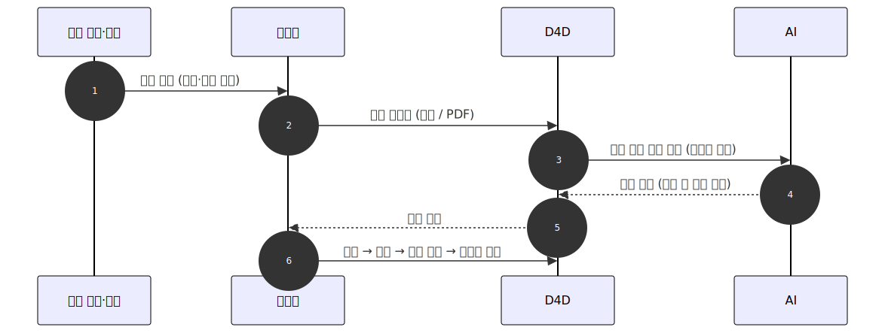

<div align="center">

# 🎯 D4D

### 전역하기 전에, 정예로.

**징병·단기복무 전술 숙달 가속 시뮬레이터** · *Conscript Readiness Accelerator*


> ### 복무는 짧아지고 병력은 줄어든다. 남은 시간 안에 초급 전투원을 정예로 만든다.
> 개인 맞춤 **적응형 사전훈련**으로 숙련을 가속하고, **지침이 바뀌면 훈련 문제도 AI가 자동으로 다시 만든다.**


<br/><br/>


<sub>트랙 · **Force Readiness, Training & Simulation** (전투준비·교육·시뮬레이션) — EGCED TECH</sub>

</div>

---

## ⏱️ 30초 요약

| | |
| --- | --- |
| **무엇을** | 정식 훈련 *전에* 전술·장비를 미리 숙달시키는 **적응형 시뮬레이터** |
| **누구를** | 복무 기간이 짧은 **초급 전투원** + 부대를 관리하는 **지휘관** |
| **어떻게** | 진단 → 약점만 골라 **개인 난이도로 집중 반복** → 부대 단위 숙련도 가시화 |
| **왜 다른가** | **교범만 올리면 AI가 훈련 문제를 자동 생성** — 지침 개정에 훈련이 실시간으로 따라감 |

---

## ❗ 문제 — 의무·단기복무의 구조적 딜레마

- ⏳ 숙련의 정점에 닿기 **전에 전역**한다
- 📉 병력은 **줄어드는데**, 한 명을 더 빨리 전력화해야 한다
- 🧩 획일적 집체 교육으론 **짧은 복무 기간 안에 정예를 못 만든다**
- 🔄 전술·장비가 바뀌어도 **훈련 콘텐츠 최신화가 못 따라간다**

---

## ✅ 해결 — D4D 사전훈련 플랫폼

**남은 시간을 최대로 쓰는 3개의 엔진.**

| | 엔진 | 한 줄 |
| :---: | --- | --- |
| **①** | **가속 학습** | 진단 → 약점 집중 반복으로 **숙련 도달 시간 압축** |
| **②** | **데이터 전력화** | 학습·체력·과제를 **부대 단위로 취합·가시화** |
| **③** | **콘텐츠 최신화** | 교범 업로드 → **AI 자동 출제**로 상시 최신 |

---

## ⭐ 킬러 기능 — 지침이 바뀌면, 훈련도 바뀐다

관리자가 개정 교범(본문/PDF)을 올리면 **AI가 그 자료만 근거로** 훈련 문항을 만든다. 출제 부담 없이 훈련이 야전의 변화를 따라잡는다.

- 🎯 **근거 기반** — 자료에 없는 내용은 생성 금지(환각 차단)
- 🔒 **스키마 강제** — Anthropic·OpenAI·Gemini 출력 구조 고정, PDF 그대로 첨부
- 🧑‍✈️ **사람이 검수** — AI는 초안만, 관리자 승인 후 배정



**📸 [ 스크린샷 자리 — AI 출제(교범 업로드 → 문항 초안 검수) 화면 ]**
<!-- 교체:  -->

---

## 🧭 트랙 적합성 — 요구 역량이 실제로 구현되어 있다

| 트랙 요구 역량 | D4D 구현 |
| --- | --- |
| 개인별 숙련도 진단·적응형 커리큘럼 | 7대 역량 진단 → 최약점을 개인 난이도로 집중 출제 + 관리자 과제 배정 |
| 장비·절차 반복 시뮬레이션 | 장비운용 포함 7역량, **상황형**·선택형 문항으로 절차 반복 숙달 |
| 약점 자동 식별·집중 훈련 추천 | 지식·체력·미완료 과제를 종합한 "지금 할 일" 추천 카드 |
| 숙련 도달 시간 단축 지표 | 역량별 점수·시도·정답·소요시간 기록 + 등급(S~D) 리포트 |
| 부대 단위 숙련도 현황 가시화 | 부대별 인원·진척 대시보드(부대 스코핑) |
| **지침 최신화 자동 반영** ⭐ | 교범 업로드 → **AI 근거 기반 자동 출제** → 검수 → 배정 |

---

## ⚙️ 동작 원리 — 숙련을 가속하는 학습 루프

**약한 곳을, 지금 실력에 딱 맞는 난이도로, 반복해서.** 이 루프가 제한된 복무 기간 안에서 숙련 도달 시간을 압축한다.



**📸 [ 스크린샷 자리 — 적응형 훈련 진행 + 역량 레이더/추천 카드 ]**
<!-- 교체:  -->

**7대 전투역량** · `전술기동` `화력운용` `지형판독` `통신절차` `전장응급처치` `화생방` `장비운용`

---
---

## 🛠️ 기술 스택 & 아키텍처

### 설계 철학 — "가볍고, 닫혀도 돌아가게"

국방 환경을 염두에 두고 **런타임 의존성 0**을 원칙으로 삼았다. 외부 패키지 없이 Node 내장 모듈만 쓰므로 공급망 공격 표면이 없고, 폐쇄망에서도 빌드·배포가 단순하다. 라우터와 WebSocket 서버까지 직접 구현해 전체 동작을 투명하게 통제한다.



### 스택

| 영역 | 채택 | 비고 |
| --- | --- | --- |
| 런타임 | **Node.js 23.4+** | `node:http`·`node:sqlite`·`node:crypto`·`node:net` |
| 언어 | **TypeScript (ESM)** | `tsc` 빌드, `--watch` 개발 |
| 데이터베이스 | **SQLite** (`node:sqlite`) | WAL 저널, FK 제약, 무설치 |
| 실시간 | **커스텀 WebSocket** | RFC 6455 직접 구현 (`lib/ws.ts`) — 알림·채팅 |
| 라우팅 | **커스텀 미니 라우터** | `:param` 지원 (`router.ts`) |
| 인증 | 세션 토큰 → **sha256 해시 저장** | httpOnly 쿠키 + `Bearer` 병행 |
| 비밀번호 | **scrypt** 해시 (`lib/password.ts`) | 타이밍 세이프 비교 |
| 시크릿 | **AES-256-GCM** (`lib/crypto.ts`) | AI 키는 암호문으로만 저장, 위·변조 탐지 (`APP_SECRET_KEY`) |
| AI | **Anthropic · OpenAI · Google Gemini** | 구조화 출력 강제, PDF 지원 |
| 문서 | **OpenAPI / Swagger UI** | `/api/docs` |
| 배포 | **Docker + Compose + GitHub Webhook** | HMAC 검증 자동배포 |

> 장병 웹앱과 관리자 콘솔은 별도 프론트엔드로 제공되며, 본 서버의 REST API와 WebSocket을 그대로 사용한다(프론트 앱 포트 `9555`). 이 저장소는 백엔드(`d4d_server`) 범위다.

### 보안 설계

- **채점은 서버가 한다.** 문항의 정답·해설은 클라이언트로 내려가지 않는다 — 클라이언트 조작이 무의미하다.
- **세션 토큰은 원문을 저장하지 않는다.** DB에는 sha256 해시만 남는다.
- **AI 키는 암호문으로만 저장.** AES-256-GCM으로 암호화하고 인증 태그로 위·변조를 탐지한다(마스터 키 `APP_SECRET_KEY`). 비밀번호는 scrypt + 타이밍 세이프 비교.
- **역할·부대 스코핑.** 관리자/장병 역할 분리, 부대 관리자는 자기 부대 데이터만 접근.
- **레이트리밋 · CORS 오리진 제한 · 관리자 가입 코드**로 오남용을 차단한다.

### 데이터 모델 (핵심 테이블)

```
units · users · sessions            부대 · 계정 · 세션
categories · questions · materials  7대 역량 · 문항 · 교범(AI 출제 근거)
user_scores · training_sessions · answers   역량별 점수 · 훈련 세션 · 답안
assignments · assignment_progress   커리큘럼(과제) 배정·수행
programs · program_progress · fitness_records   체력/교육 프로그램 · 특급전사 기록
ai_providers                        AI 연동 (암호화 키)
chat_threads · chat_messages · notifications   실시간 채팅 · 알림
```

### 디렉토리 구조

```
src/
├── index.ts        # HTTP 서버 + WS 업그레이드 + CORS + 에러/로깅
├── config.ts       # .env 로드 및 설정
├── router.ts       # 초소형 라우터 (:param 지원)
├── db/             # SQLite 연결·스키마(migrate)·시드(seed)
├── middleware/     # 세션 인증 (requireAuth / requireAdmin)
├── routes/         # auth · training · curriculum · recommend · report
│                   # admin · chat · fitness · programs · notifications · categories
└── lib/            # ai(출제) · ws · score · crypto · password · rateLimit · http · notify
```

---

## 📡 API

**Swagger 문서: `http://localhost:9666/api/docs`** (스펙 JSON: `/api/docs/openapi.json`)
Authorize 버튼에 로그인 응답의 `token` 을 넣으면 브라우저에서 바로 테스트할 수 있다.

| Method | Path | Auth | 설명 |
| --- | --- | --- | --- |
| POST | `/api/auth/register` · `/login` | - | 가입/로그인 (장병은 부대 코드 필수) |
| GET | `/api/me/scores` | ✓ | 내 카테고리별 점수 프로필 |
| POST | `/api/training/sessions` | ✓ | 세션 시작 `{mode: 'diagnostic'\|'adaptive'}` → 문항(정답 제외) |
| POST | `/api/training/sessions/:id/answers` | ✓ | 답안 제출 → 서버 채점/해설/점수 |
| GET | `/api/report` · `/api/me/assignments` | ✓ | 학습 리포트 / 배정 과제 |
| GET | `/api/admin/dashboard` | 관리자 | 부대 현황 대시보드 |
| GET/POST | `/api/admin/materials` | 관리자 | 교범 자료 목록 / 등록 (본문·PDF) |
| POST | `/api/admin/materials/:id/generate-questions` | 관리자 | **AI 문항 초안 생성** |
| GET/POST | `/api/admin/questions` · `/api/admin/assignments` | 관리자 | 문항 검수·저장 / 과제 배정 |
| GET/POST | `/api/admin/ai-providers` | 관리자 | AI 연동 (키 암호화 저장) |

점수 규칙: 정답 `+points`, 오답 `−⌈points/2⌉`, 0~100 클램프. 등급 S(90+)/A(75+)/B(60+)/C(40+)/D.

---

## ▶️ 실행

```bash
cp .env.example .env   # 값 채우기
npm run dev            # 개발 (--watch)
npm start              # 운영
```

최초 기동 시 SQLite(`data/d4d.db`)에 스키마와 기본 데이터(카테고리·문항·교범 자료)가 자동 주입되고, 관리자 계정이 생성된다. `ADMIN_PASSWORD` 를 비워두면 랜덤 비밀번호가 로그에 1회 출력된다.

---

## 🚀 배포 (front 와 동일한 웹훅 방식)

GitHub push → 웹훅 서버(`:9446`)가 HMAC 검증 후 `deploy/deploy.sh` 실행 → docker build → 컨테이너 교체(포트 `9666`). SQLite 데이터는 네임드 볼륨 `d4d-server-data` 에 보존된다.

```bash
bash deploy/webhook-up.sh          # 웹훅 컨테이너 기동
bash deploy/deploy.sh              # 수동 배포
docker logs -f d4d-server          # API 로그
docker run --rm -v d4d-server-data:/data alpine \
  tar czf - -C /data . > d4d-backup.tar.gz   # DB 백업
```

포트 정리: front 앱 `9555` / front 웹훅 `9444` / **server API `9666` / server 웹훅 `9446`**

<details>
<summary><b>트러블슈팅</b></summary>

**`Error: unable to open database file` (ERR_SQLITE_ERROR, errcode 14)** — DB 디렉터리에 컨테이너 사용자(node, uid 1000)가 쓸 수 없는 경우다. 기본 구성(네임드 볼륨 `d4d-server-data`)에서는 발생하지 않는다. 직접 바인드 마운트로 바꿨다면 호스트에서 `sudo chown -R 1000:1000 <호스트경로>` 로 소유권을 맞춰야 한다. 배포 스크립트는 웹훅 컨테이너 안에서 실행되므로, 바인드 마운트가 필요하면 반드시 **호스트 기준 절대경로**를 사용할 것.

</details>

---

<div align="center">
<sub><b>D4D</b> — 짧아진 복무 기간을, 더 빠른 숙련으로. · EGCED TECH · Force Readiness, Training & Simulation</sub>
</div>
